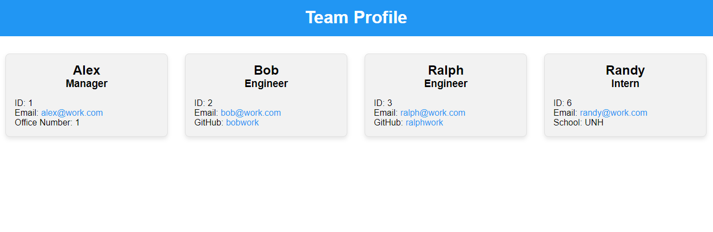

# Team Profile Generator

A command-line application that generates a professional team profile page, so you can easily keep track and showcase your team members.  

## Table of Contents

1. [Installation](#installation)
2. [Usage](#usage)
3. [Features](#features)
4. [Testing](#testing)
5. [Contribution](#contribution)
6. [License](#license)

## Installation

To install the Team Profile Generator, follow these steps:

1. Clone the repository to your local machine.
2. Navigate to the root directory of the project in your terminal.
3. Run `npm install` to install the necessary dependencies.

```sh
git clone git@github.com:Tunestring/m10challenge.git
cd team-profile-generator
npm install
```

## Usage

To run the Team Profile Generator, navigate to the root directory of the project in your terminal and run:

```sh
node index.js
```

Follow the prompts to input information about the team manager and then team members (Engineers and Interns). Once you're done adding team members, the application will generate an HTML file in the `output` directory, which you can view in your web browser.

## Features

- Interactive command-line interface.
- Supports adding a team manager, engineers, and interns.
- Generates a styled HTML page with team members' information.
- Each team member card displays the name, role, email, and additional information (GitHub profile for engineers, office number for the manager, and school for interns).


  


## Testing

This application includes test suites for the classes (Employee, Manager, Engineer, Intern). To run the tests, navigate to the root directory of the project in your terminal and run:

```sh
npm test
```

Ensure that all tests pass to validate that the classes are functioning as expected.

## Contribution

Contributions are welcome. If you are interested in contributing to this project, please fork the repository and submit a pull request.

## License

This project is licensed under the MIT License. Refer to the [LICENSE](./LICENSE) file for more information.

## Questions?

If you have any questions or run into any issues, please open an issue on this repository.

You can also contact me via email at nate.k.long@gmail.com.

---

Made with ❤️ by [Nate Long](https://github.com/tunestring)